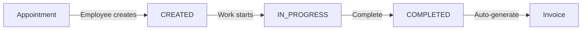
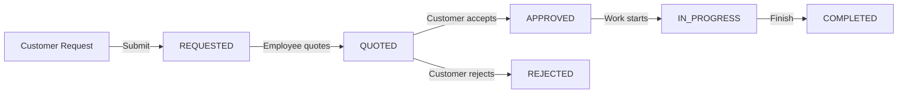

# Project Service - Quick Start Guide

## Quick Reference

### Base URL
```
http://localhost:8084
```

### Common Headers
```http
Authorization: Bearer <jwt-token>
X-User-Subject: <user-id>
X-User-Roles: ROLE_CUSTOMER (or ROLE_EMPLOYEE, ROLE_ADMIN)
```

---

## API Endpoints Quick Reference

### Services

#### Create Service
```http
POST /services
Role: EMPLOYEE

{
  "appointmentId": "APT-001",
  "estimatedHours": 3.0,
  "customerId": "customer-uuid",
  "assignedEmployeeIds": ["employee-uuid"]
}
```

#### Update Service
```http
PATCH /services/{serviceId}
Role: EMPLOYEE

{
  "status": "IN_PROGRESS",
  "progress": 60,
  "notes": "Replaced brake pads",
  "estimatedCompletion": "2025-11-05T18:00:00"
}
```

#### Complete Service
```http
POST /services/{serviceId}/complete
Role: EMPLOYEE

{
  "finalNotes": "Service completed successfully",
  "actualCost": 250.00,
  "additionalCharges": [
    {
      "description": "Air filter",
      "quantity": 1,
      "unitPrice": 25.00,
      "amount": 25.00
    }
  ]
}
```

#### Upload Photos
```http
POST /services/{serviceId}/photos
Role: EMPLOYEE
Content-Type: multipart/form-data

files: [photo1.jpg, photo2.jpg]
```

#### Add Note
```http
POST /services/{serviceId}/notes
Role: EMPLOYEE

{
  "note": "Checked all fluid levels",
  "isCustomerVisible": true
}
```

---

### Projects

#### Request Project
```http
POST /projects
Role: CUSTOMER

{
  "vehicleId": "VEH-001",
  "description": "Install custom exhaust system",
  "budget": 5000.00
}
```

#### Submit Quote
```http
PUT /projects/{projectId}/quote
Role: EMPLOYEE/ADMIN

{
  "quoteAmount": 5000.00,
  "notes": "Labor: $3000, Parts: $2000"
}
```

#### Accept Quote
```http
POST /projects/{projectId}/accept
Role: CUSTOMER
```

#### Update Progress
```http
PUT /projects/{projectId}/progress
Role: EMPLOYEE/ADMIN

{
  "progress": 45
}
```

---

## Status Enums

### ServiceStatus
- `CREATED` - Service just created
- `IN_PROGRESS` - Work in progress
- `ON_HOLD` - Temporarily paused
- `COMPLETED` - Finished
- `CANCELLED` - Cancelled

### ProjectStatus
- `REQUESTED` - Customer requested
- `QUOTED` - Quote submitted
- `APPROVED` - Quote accepted
- `IN_PROGRESS` - Work started
- `COMPLETED` - Project finished
- `REJECTED` - Quote rejected
- `CANCELLED` - Project cancelled

### InvoiceStatus
- `DRAFT` - Being prepared
- `PENDING` - Awaiting payment
- `PAID` - Payment received
- `OVERDUE` - Past due date
- `CANCELLED` - Invoice cancelled

---

## Common Workflows

### Standard Service Workflow



1. Employee creates service from appointment
2. Service status: CREATED
3. Employee adds notes and uploads photos
4. Employee updates progress
5. Service status changes to IN_PROGRESS
6. Employee completes service
7. Invoice automatically generated

### Custom Project Workflow



1. Customer requests modification
2. Project status: REQUESTED
3. Employee/Admin submits quote
4. Project status: QUOTED
5. Customer accepts or rejects
6. If accepted: APPROVED → IN_PROGRESS → COMPLETED

---

## Database Tables

### Key Tables
- `standard_services` - Services from appointments
- `projects` - Custom modifications
- `service_notes` - Work notes
- `progress_photos` - Service photos
- `invoices` - Generated invoices
- `invoice_items` - Invoice line items
- `quotes` - Project quotes

---

## Testing with cURL

### Create Service
```bash
curl -X POST http://localhost:8084/services \
  -H "Authorization: Bearer $JWT_TOKEN" \
  -H "X-User-Subject: employee-uuid-1" \
  -H "Content-Type: application/json" \
  -d '{
    "appointmentId": "APT-001",
    "estimatedHours": 3.0,
    "customerId": "customer-uuid-1",
    "assignedEmployeeIds": ["employee-uuid-1"]
  }'
```

### Get Services
```bash
curl http://localhost:8084/services \
  -H "Authorization: Bearer $JWT_TOKEN" \
  -H "X-User-Subject: customer-uuid-1"
```

### Upload Photos
```bash
curl -X POST http://localhost:8084/services/{serviceId}/photos \
  -H "Authorization: Bearer $JWT_TOKEN" \
  -H "X-User-Subject: employee-uuid-1" \
  -F "files=@photo1.jpg" \
  -F "files=@photo2.jpg"
```

---

## Environment Setup

### Required Environment Variables
```bash
export DB_HOST=localhost
export DB_PORT=5432
export DB_NAME=techtorque_projects
export DB_USER=techtorque
export DB_PASS=techtorque123
export SPRING_PROFILE=dev
```

### Database Setup
```sql
CREATE DATABASE techtorque_projects;
```

### Start Service
```bash
cd Project_Service/project-service
./mvnw spring-boot:run
```

---

## Troubleshooting

### Common Issues

**Issue: "Service not found"**
- Verify serviceId is correct
- Check if service exists in database

**Issue: "Unauthorized access"**
- Verify JWT token is valid
- Check X-User-Subject header matches user
- Verify user role has permission

**Issue: "File upload failed"**
- Check file size < 10MB
- Verify uploads directory exists
- Check disk space

**Issue: "Invoice not found"**
- Verify service has been completed
- Invoice only generated after completion

---

## Sample Test Data (Dev Profile)

### Services
- `serviceId`: Check database after seeding
- Customer: customer-uuid-1, customer-uuid-2
- Employee: employee-uuid-1, employee-uuid-2

### Projects
- Customer: customer-uuid-1 (2 projects)
- Customer: customer-uuid-2 (1 project)

---

## Useful Queries

### Check Service Status
```bash
curl http://localhost:8084/services/{serviceId} \
  -H "Authorization: Bearer $JWT_TOKEN" \
  -H "X-User-Subject: customer-uuid-1"
```

### Get All Notes
```bash
curl http://localhost:8084/services/{serviceId}/notes \
  -H "Authorization: Bearer $JWT_TOKEN" \
  -H "X-User-Subject: customer-uuid-1"
```

### Get Invoice
```bash
curl http://localhost:8084/services/{serviceId}/invoice \
  -H "Authorization: Bearer $JWT_TOKEN" \
  -H "X-User-Subject: customer-uuid-1"
```

---

## Development Tips

1. **Enable dev profile** for test data:
   ```
   SPRING_PROFILE=dev
   ```

2. **Check Swagger UI** for interactive testing:
   ```
   http://localhost:8084/swagger-ui/index.html
   ```

3. **View database** to verify data:
   ```sql
   SELECT * FROM standard_services;
   SELECT * FROM invoices;
   ```

4. **Monitor logs** for debugging:
   ```bash
   tail -f logs/project-service.log
   ```

---

## Need Help?

- **Swagger UI**: http://localhost:8084/swagger-ui/index.html
- **API Design**: See `complete-api-design.md`
- **Implementation Details**: See `IMPLEMENTATION_SUMMARY.md`
- **Audit Report**: See `PROJECT_AUDIT_REPORT_2025.md`

---

**Quick Links**
- [README.md](./README.md) - Full documentation
- [IMPLEMENTATION_SUMMARY.md](./IMPLEMENTATION_SUMMARY.md) - Implementation details
- [Swagger UI](http://localhost:8084/swagger-ui/index.html) - Interactive API docs
